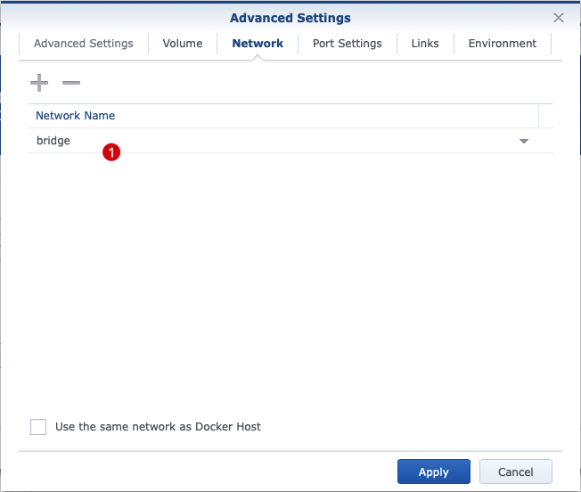

# Github Webhook Framework

An extensible and flexible Python code based Github webhook handling framework. This repository provides examples of how to send notifications to Microsoft Teams when specific events occur in a repository or an organization. 

## Purpose

We want to keep all repositories in our Github organization in view and be able to react to events at an early stage. To do this, we use Microsoft Teams (or any other comparable tool) to receive and track events within dedicated channels. Since events in Github only remain in the log for 90 days, we decided to use an additional external platform.

Alternatively, pull-queries of the Github API could be used. However, the disadvantage of this approach is that the queries take place in time intervals, the events are provided via the API time-shifted (up to 5 minutes) and the events provided via the API correspond to the content via the webhooks. For more details please refer to the section 'Evaluation of different approaches'.

Using the Webhooks it is therefore possible to react to events in a timely manner. Thus, in addition to notifications about the example, push events can be checked and an investigation can be made for the publication of sensitive information. A reaction to inappropriate content is thus possible faster than known tools that try to access sensitive information via the public API.

Limitation: Currently no events are recorded at the configuration of the organization (events of type `enterprise`). This script in connection with a free account is not fully suitable for tracking configuration changes for a revision.

## Table of content

<!-- TOC -->

- [Purpose](#purpose)
- [Table of content](#table-of-content)
- [Requirements](#requirements)
- [Advantages](#advantages)
- [Sequence diagram](#sequence-diagram)
- [Installation](#installation)
    - [Setting up the webhook call in Github](#setting-up-the-webhook-call-in-github)
    - [Cloning the Github repository](#cloning-the-github-repository)
    - [Set up dependencies](#set-up-dependencies)
    - [Configuration](#configuration)
    - [Adding hooks](#adding-hooks)
    - [Hook configuration](#hook-configuration)
- [Deploy](#deploy)
    - [Python](#python)
    - [Apache](#apache)
    - [Docker](#docker)
    - [Docker @ Synology](#docker--synology)
- [Test your deployment](#test-your-deployment)
- [Debug](#debug)
- [Notes on infrastructure](#notes-on-infrastructure)
- [Notes on data protection](#notes-on-data-protection)
- [License](#license)
- [Credits](#credits)
- [Evaluation of different approaches](#evaluation-of-different-approaches)
    - [Hooks (client-side)](#hooks-client-side)
    - [Actions (sever-side)](#actions-sever-side)
    - [Webhooks](#webhooks)
    - [API](#api)
    - [Conclusion](#conclusion)

<!-- /TOC -->

## Requirements

- Python 3.6+
- Python Module (see requirements.txt)
- Docker
- Microsft Teams
    - Microsoft Connector `Incoming Webhook`
    - Microsoft Teams Channel

## Advantages

- Support for all Github events
- flexible parsing system for event payloads
- no code adjustment necessary
- flexibly extensible code
- different options for the execution
- productively applicable

## Sequence diagram

    graph TD
    A[Github] -->|send event| B(Github event engine)
    B -->|send event json| C{Webhook Framework}
    C -->|event typ: all| D(all)
    D -->|message json| E[MS Teams]
    C -->|http status code| B
    C -->|event type: push| F(fa:fa-car push)
    F -->|git clone ...| G[local hdd]
    C -->|event type: ...| H[...]
    H -->|...| I[...]

## Installation

### Setting up the webhook call in Github

In the repository or organization, the target address must be specified in the format `http://<ip>:5000` under the settings under Webooks. The default port in the repo is 5000. As events to send we recommend to send all events to be able to use the script as flexible as possible and not to miss any important events later.

### Cloning the Github repository

    git clone https://github.com/generaliinformatik/github-webhook-framework.git
    cd github-webhook-framework

### Set up dependencies

The dependencies to Python modules can be set up by calling

    sudo pip install -r ./app/requirements.txt

### Configuration

You can configure what the application does by copying the sample config file
``config.json.sample`` to ``config.json`` and adapting it to your needs:

    {
        "github_ips_only": true,
        "enforce_secret": "",
        "return_scripts_info": true,
        "hooks_path": "hooks",
        "backup_path": "backup",
        "debug_level": "INFO"
    }

| Key | Value | Default |
| --- | --- | --- |
| http_port | Default flask HTTP port of webservice. Adjust this parameter if a different port is required for operation in the deployment scenario. | ``5000`` |
| github_ips_only | Restrict application to be called only by GitHub IPs. IPs  whitelist is obtained from `GitHub Meta <https://developer.github.com/v3/meta/>` (`endpoint <https://api.github.com/meta>`_).  | ``true`` |
| enforce_secret | Enforce body signature with HTTP header ``X-Hub-Signature``. See ``secret`` at GitHub WebHooks Documentation <https://developer.github.com/v3/repos/hooks/> or <https://developer.github.com/webhooks/securing/>. **We strongly recommend to assign this parameter with a high entrophy to protect you against spam or fraud. We recommend a minimum length of 32 characters!** Please don't forget to set this secret in your webhook of Github as well.| ``''`` (do not enforce) |
| return_scripts_info | Return a JSON with the ``stdout``, ``stderr`` and exit code for each executed hook using the hook name as key. If this option is set you will be able to see the result of your hooks from within your GitHub hooks configuration page (see "Recent Deliveries"). |``true`` |
| hooks_path | Configures a path to import the hooks. If not set, it'll import the hooks from the default location. | ``hooks``|
| backup_path | Configures a path to backup received JSON data as file. If not set or path not valid, no backup file is created. | ``''`` (no backup)|
| debug_level | Defines the debug level. Valid option sare `DEBUG`, `INFO`, `WARNING`, `CRITICAL`. Default is `INFO`. | `INFO` |

The configuration file is read in anew with every HTTP request before commands are executed. This allows the settings to be adjusted dynamically.

### Adding hooks

This application will execute scripts in the hooks directory using the following order:

    hooks/{event}-{repository name}-{branch}
    hooks/{event}-{repository name}
    hooks/{event}
    hooks/all-{repository name}-{branch}
    hooks/all-{repository name}
    hooks/all

**Note:** All hooks that are interpreted as matching are called one after the other, so different actions can be performed on an single event.

The application will pass to the hooks the path to a JSON file holding the
payload for the request as first argument. The event type will be passed
as second argument. For example:

    hooks/push-myrepo-master /tmp/sXFHji push

Hooks can be written in any scripting language as long as the file is
executable and has a shebang. The file must not contain a file extension. A simple example in Python could be:

    #!/usr/bin/env python3
    # Python Example for Python GitHub Webhooks
    # File: push-myrepo-master

    import sys
    import json

    with open(sys.argv[1], 'r') as jsf:
      payload = json.loads(jsf.read())

    ### Do something with the payload
    name = payload['repository']['name']
    outfile = '/tmp/hook-{}.log'.format(name)

    with open(outfile, 'w') as f:
        f.write(json.dumps(payload))

Not all events have an associated branch, so a branch-specific hook cannot
fire such event scripts. For events that contain a pull_request object, the
base branch (target for the pull request) is used, not the head branch.

The payload structure depends on the event type. Please review:

    https://developer.github.com/v3/activity/events/types/

#### Hook call/execution

The configuration of the hooks depends on the hooks used. The sample hooks contained in the repository are used to send notifications about the github events to Microsoft Teams and to clone repositories locally. 

To get notifications about all events, the hook file `all` is used. This script interprets the parameter JSON data (parameter #1) and event name (parameter #2) and complete the notification task.

If the event `push` in branch `master`of repository `repo1` occurs, the scripts (in that order)

    hooks/push-repo1-master 
    hooks/push-repo1
    hooks/push
    hooks/all-repo1-master
    hooks/all-repo1
    hooks/all

are called. Some sample scripts are given to demonstrate the procedure.

### Hook configuration

#### Sample: Notification

The `all` script interprets the parameters passed and reads the configuration file corresponding to the name of the event that has occurred. If a corresponding configuration file exists for the event, it is read and used to send the message. In this example we assume that Microsft Teams is used.

Example: If the event `push` occurs, the script `hooks/all` tries to read the configuration file `hooks/all.json` and use its contents of section `push` to send the message. If no configuration file is found, no message is sent (because no webhook adress is known). The following settings are possible in the configuration file:

| Key | Value | Placeholder | Optional | Default |
| --- | --- | :-: | :-: | -- |
| webhook | The URL of the Microsoft Team Webhook. This URL must be specified for the respective channel with the Webhook Connector previously set up. This option will be overwritten, if `event/webhook` is set within an event configuration. | - | - | '' |
| event/webhook | The URL of the Microsoft Team Webhook. This URL must be specified for the respective channel with the Webhook Connector previously set up. | - | - | '' |
| event/color | Color code to be used for message,. This color is used as colored seperator line  between webhook name and message title/content.| &#10003; |  &#10003; | '' |
| event/title | The message title for this kind of event. Any placeholder will be replaced (see placeholder handling). |  &#10003;|  &#10003; | '' |
| event/message | The message content for this kind of event. Any placeholder will be replaced (see placeholder handling). | - | - | '' |

#### Sample: Git Clone at Push

The second example illustrates the event and hook `push`. This hook is additionally executed after the `all` hook for all `push` events. 

The main purpose of this script is to clone a repository locally when a push event occurs. The following settings are also included in the `push.json` and control the backup of the repository:

| Key | Value | Placeholder | Optional | Default |
| --- | --- | :-: | :-: | -- |
| git_url | The URL of the Git Repository to be cloned. This value usually does not need to be adjusted, since it corresponds to the dynamic value of the Git Repository URL.  | &#10003; | - | `{repository/html_url}` |
| clone_dir |  The directory in which the clone is created. In the specified directory, a subdirectory with timestamp is created in which the clone is created. This allows a repository to be saved in any state without overwriting the previous clones. | - |  - | `backup.git` |

#### Placeholder handling

In the title or message, content from the passed JSON of the event that occurred, can be specified. These are embedded in brackets hierarchically according to the JSON structure. A `{comment/title}` specification thus determines the key `title` from the JSON in the `comment` structure and embeds the content instead of the placeholder. Placeholders that are not resolved are replaced by 'null'. Further levels can be specified accordingly (example: `{1/2/3/4}`).

The placeholder `{event}` is a special case, because it is not propagated within the playload. This placeholder is permanently replaced with the determined event type and can be used in all elements.

The advantage of the hierarchical path specification method is that the contents of the JSON can be used dynamically without the need to modify a script and the use of variable assignments. For other messages and content, all you need to do is determine the structure and content of the JSON and use the path to the desired content as a placeholder `{...}`. Please see payload structure as mentioned above.

## Deploy

### Python

To execute the script from the command line, simply call

    cd ./app
    python3 main.py

### Apache

To deploy in Apache, just add a ``WSGIScriptAlias`` directive to your
VirtualHost file:

    <VirtualHost *:80>
        ServerAdmin you@my.site.com
        ServerName  my.site.com
        DocumentRoot /var/www/site.com/my/htdocs/

        # Handle Github webhook
        <Directory "/var/www/site.com/my/python-github-webhooks">
            Order deny,allow
            Allow from all
        </Directory>
        WSGIScriptAlias /webhooks /var/www/site.com/my/python-github-webhooks/app/main.py
    </VirtualHost>

You can now register the hook in your Github repository settings:

    https://github.com/youruser/myrepo/settings/hooks

To register the webhook select Content type: ``application/json`` and set the URL to the URL of your WSGI script:

    http://my.site.com/webhooks

### Docker

To deploy in a Docker container you have to expose the port 5000, for example with the following command:

    docker build --pull -f ./Dockerfile -t webhooks:latest .
    docker run -p 5000:5000 webhooks:latest  

You can also mount volume to setup the ``./hooks/``, ``./backup.git/`` or ``./backup.json/`` directories, and the file ``config.json``:

    docker run --name webhooks \
      -v /path/to/my/hooks:/app/hooks \
      -v /path/to/my/backups:/app/backups.json \
      -v /path/to/my/git:/app/backup.git \
      -v /path/to/my/config.json:/app/config.json \
      -p 5000:5000 webhooks:latest

Alternatively, the script file `./deploy_docker.sh` can be called, in which the above mentioned commands are called automatically. Variables in the script file can be used to customize the execution. 

#### Use under Openshift 

The basis Dockerfile can be used under Docker and Openshift. For the use under Openshift the script `./deploy_openshift.sh` can be used.

### Docker @ Synology

To use the solution as a docker container on your Synology we would like to give the following tips for the setup.
    
    The screenshots are the German interface, but we will describe the options in detail.

Once the image has been integrated into Docker for Synology, it can be used to create a container. First, the 'Container Name' must be unique.

On the `Volume` page, volumes can be mounted to the container. In this example, the following subfolders have been set up with reference in the Docker Container under the path `/volume1/docker.apps/github-webhooks-framework`.

| Reference to Synology | Reference in Container | Type | Content
| --- | --- | :-- | --- |
| _<1>_/backup.git| _<2>_/backup.git | directory | repository clones |
| _<1>_/backup.json| _<2>_/backup.json | directory | backup copies of github JSONs |
| _<1>_/hooks | _<2>_/hooks/ | directory | hook scripts |
| _<1>_/config.json | _<2>_/config.json | file | configuration file main script | 
_Legende:_  
_<1> = /volume1/docker.apps/github-webhooks-framework_  
_<2> = /opt/repo/app_

The settings for the `Network` can be left at `bridge` by default because we need to do a port mapping and the system does not need its own IP from the host network.

Finally, we set up the port mapping under `Port Settings`. This is necessary because port 5000 inside the container collides with default DMS HTTP port 5000 typically. We therefore set up the port on which we are listening on the host (here exemplary `55000`) and redirect it to port 5000 inside the container.

    At this point, there are several possibilities, depending on the respective network configuration. In this case, we assume that the webhook sends via github on your public IP to port 55000. This port is shared in the router and forwarded to the IP from the Synology Product. Here, the packets on port 55500 are received and forwarded to the container.

#### Adaptation of the (internal) port

The port to be used internally is currently set to `5000`. It may sometimes be necessary to adjust the port within the container or the user may have his own preferences. However, in most cases it should be sufficient to implement a change of the port propagated to the outside world via the command `docker run -p <port>:<Port> ...`.

Otherwise, the port is configured for the services contained in the docker file in the following files:

| File | Mention in file | Port |
| --- | --- | :-: |
| ./deployment/nginx.conf | `listen 5000;` | 5000 |
| ./deployment/Dockerfile | `EXPOSE 5000:5000` | 5000 |
| ./app/main.py | `app.run(debug=True, host='0.0.0.0', port=5000)` | 5000 |

Please note that it may be necessary to set port forwarding in routers if the system is not directly accessible. 

## Test your deployment

To test your hook you may use the GitHub REST API with ``curl``. See:

    https://developer.github.com/v3/

If you have no 2FA (two factor athentication) activated, you can fire an event via:

    curl --user "<youruser>" https://api.github.com/repos/<youruser>/<myrepo>/hooks

 Take note of the test_url.

    curl --user "<youruser>" -i -X POST <test_url>

You should be able to see any log error in your webapp. If 2FA is activated, you have to use an token.

## Debug

When running in Apache, the ``stderr`` of the hooks that return non-zero will
be logged in Apache's error logs. For example:

    sudo tail -f /var/log/apache2/error.log

Will log errors in your scripts if printed to ``stderr``.

You can also launch the Flask web server in debug mode at port ``5000``.

    cd ./app
    python main.py

This can help debug problem with the WSGI application itself.

## Notes on infrastructure

Microsft Teams is typically used as a cloud-based solution. Github is also often used by companies as a cloud solution.

In a later deployment scenario of the Webhooks framework, it should be considered whether the solution will be used as a cloud-based or so-called on-premise service.

Since webhooks are typically sent to an address by push, this would mean, when used in corporate infrastructures, that a system in an internal infrastructure or a DMZ would have to be provided for the mere passing of a message. It is therefore advisable to consider whether the solution could not also be used in a cloud-based infrastructure.

Services that are based on on-premise infrastructures can - if the service allows it - be used by pull method, which means that internal systems establish a connection to the framework and thus no firewall port has to be explicitly opened for communication. 

In accordance with the recommendation, communication is carried out as follows:

## Notes on data protection

The underlying information is per se classified as public information by the user due to the intention to publish it on Github. Only the information published by the user can be classified as critical for IT security or privacy reasons.

The information can be accessed via browser or REST client at

    https://api.github.com/repos/:user/:repository/events

(:user = user or organization name / :repo = repository name)

This means that this information is already available to other users when an event occurs.

When using this framework, this publicly visible information is processed by additional services. A consideration under information protection aspects is therefore not necessary per se.

However, we would like to point out that the publication of sensitive information can still become relevant by integrating additional services. For this reason, we recommend under all circumstances that you use the Framework Service on infrastructure that is under your own (preferably complete) control. An appropriate reaction to security-relevant events is recommended in any case - regardless of the number or type of third-party infrastructures used. For example, sensitive information must be removed immediately and your own infrastructures must be secured (e.g. if access data is published).

## License

APLv2, see [LICENSE](LICENSE)

## Credits

This project is a reinterpretation and merge of several approaches and uses the basic approach of Carlos Jenkins:

- python-github-webhooks <https://github.com/carlos-jenkins/python-github-webhooks>

Thanks.

## Evaluation of different approaches

### Hooks (client-side)

#### Advantages

- flexible
- any language
- local execution
- fast realization
- execution before publication

#### Disadvantages

- installation required by each user
- execution not ensured
- quality of hooks not uniform 
- the sending of events depends on the configuration on the client side
- no events of the organization configuration

### Actions (sever-side)

#### Advantages

- central approach
- can be flexibly set up per repository

#### Disadvantages

- must be set up for each repository
- default is binding for all users (can also be a hindrance when external contributors are involved)
- no events of the organization configuration

### Webhooks

#### Advantages

- can be set up both per repository and for an organization (central approach)
- adaptive approach
- no strong impairment of forks

#### Disadvantages

- no events of the organization configuration
- event only occurs if actions have already been executed on Github

### API

#### Advantages

- registration of all occurred and supported events 
- events can still be retrieved 90 days after they occur

#### Disadvantages

- no events of the organization configuration
- event only occurs if actions have already been executed on Github

### Conclusion

Finally, it can be argued that a mixed operation of Webhook and API is advantageous if the target server was temporarily unavailable for receiving the events. In this case, it is recommended to compare the received events with the available Github levels on a regular basis. The test must be performed every 90 days at the latest, but should be performed at much shorter notice due to some time-critical reactions to certain events. 
